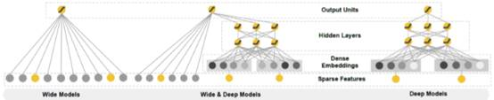
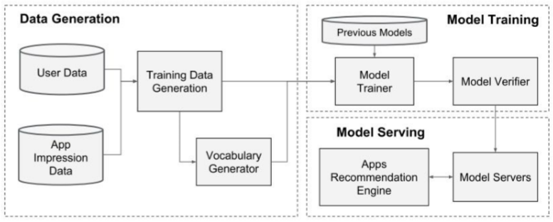
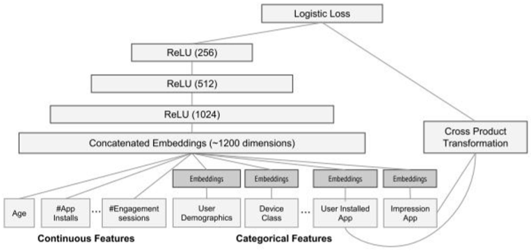

# Wide&deep理论与实践

[TOC]

# 背景

利用手工构造的交叉组合特征来使线性模型具 有“记忆性”，使模型记住共现频率较高的特征组合，往往也能达到一个不错的baseline，且可解释性强。但这种方式有着较为明显的缺点：首先，特征工程需要耗费太多精力。其次，因为模型是强行记住这些组合特征的，所以对于未曾出现过的特征组合，权重系数为0，无法进行泛化。

为了加强模型的泛化能力，研究者引入了DNN结构，将高维稀疏特征编码为低维稠密的 Embedding vector，这种基于Embedding的方式能够有效提高模型的泛化能力。基于Embedding的方式可能因为数据长尾分布，导致长尾的一些特征值无法被充分学习，其对应的Embedding vector是不准确的，这便会造成模型泛化过度。

2016年，Google提出Wide&Deep模型，将线性模型与DNN很好的结合起来，在提高模型泛化能力的同时，兼顾模型的记忆性。Wide&Deep这种线性模型与DNN的并行连接模式，后来成为推荐领域的经典模式。

# Wide&Deep模型

## 模型概述

wide&deep模型同时构建两个网络：liner model（wide） 和 deep nerual network（deep），拼接两个网络的输出再进入sigmoid函数，使得参数更新时可以同时感知到这两个网络。因此，可以把wide&deep模型拆分为wide和deep两部分，单个的wide就是线性模型（如LR），单个的deep模型就是dnn。wide和deep分别负责两种能力Memorization（记忆）与Generalization（泛化）。

Memorization是指模型能够从历史数据中学习到高频共现的特征组合的能力。而 Generalization代表模型能够利用相关性的传递性去探索历史数据中从未出现过的特征组合。其实质也可以理解为Memorization负责利用（Exploitation），而Generalization负责探索（Exploration），也就是探索和利用的问题。Wide （线性部分）善于memorization，即从历史数据中学习特征的共性和相关性；DNN（深度神经网络模型）称之为Deep，善于Generalization，即善于发现历史数据中很少或者没有出现过的新的特征组合，从而提高推荐物品的多样性（泛化能力）。

 广义线性模型能够很好的解决Memorization的问题，但是在Generalization方面表现不足，基于Embedding的DNN模型在Generalization方面表现优异，但是在数据分布较为长尾的情况下，对于长尾数据的处理能力较弱，容易造成过度泛化。

作者将二者进行结合，取两者之长，使得模型同时兼顾Memorization与Generalization，提出了二者兼备的Wide&Deep模型，并在Google Play store的场景中成功落地。

## 模型结构

模型结构示意图如下：

示意图中左边便是模型的Wide部分，这个部分可以使用广义线性模型来替代，如LR便是简单的一种。右侧是模型的Deep部分，也就是DNN。中间是Wide&Deep模型的结构。由此可见，Wide&Deep是一类模型的统称，将LR换成FM同样也是一个Wide&Deep 模型。模型的Deep部分是一个简单的基于Embedding的全连接网络。 

### Wide  Part

wide部分是一个广义线性模型，它的输入与输出直连，但是在的特征部分包括原始特征和组合特征（cross-product transformation）。组合特征在wide网络中非常重要，可以帮助线性模型捕捉特征直接的交互信息，为模型增加一定的非线性。wide部分的公式如下：
$$
y=W^T[X,\varphi(x)]+b
$$
 其中，$y$是要预测目标，b是bias， $X=[x_1,x_2,...,x_d]$是$d$维特征向量，属于原始的输入feature。$\varphi(x)=[\varphi_1(x),\varphi_2(x),...,\varphi_k(x)]$是$k$维特征转化向量，也就是交叉特征。 

交叉特征部分最常用的特征转换函数是特征交叉函数转换（cross  product  transformation），定义为$\varphi(X)=\Pi_{i=1}^{d}x_{i}^{c_{ki}},c_{ki}\in[0,1]$，当且仅当$x_i$是第k个特征变换的一部分时，$c_{ki}=1$，否则为0。

举例来说，对于二值特征，一个特征交叉函数为$And(gender=female,language=en)$， 这个 函数中只涉及到特征female与en，所以其他特征值对应的 $c_{ki}=0$，即可忽略。当样本中female与en同时存在时，该特征交叉函数为1，否则为0。

再举例如下：假如x1是性别，x1=0表示男性，x1=1表示女性。x2是爱好，x2=0表示不喜欢吃西瓜，x2=1表示喜欢吃西瓜。那么 我们就可以利用x1和x2构造出新的feature，令x3=(x1 && x2)，则x3=1表示是女生并且喜欢吃西瓜，如果不是女生或者不喜欢吃西瓜，则x3=0。这样经过转换的来的x3就是cross-product转化。

这样转换的目的是为了获取交叉特征对预测目标的影响，给线性模型增加非线性。这种转换是针对分类特征处理的一种比较好的手段，提高了wide模型的表达能力，论文的原话是“adds nonlinearity to generalized linear model”。

wide部分主要负责记忆（memorization），模型效果表现为可以从历史数据中挖掘出物品/特征之间的关联，记忆那些出现频繁的共现结构。对于没有在历史数据中出现过的共现结构，wide部分表现欠佳。 

## Deep  part

Deep部分是简单的全连接网络（前馈神经网络DNN），主要的作用是用于对基础特征的自动挖掘，从而学习到更深层次的交叉特征。DNN几乎不需要特征工程，通过对低纬度的稠密特征进行组合可以学习到更深层次的隐藏特征。在Deep部分，对于高维稀疏的分类特征，首先会转化成低维的稠密的向量（Embedding vectors），然后作为神经网hidden layers的输入进行训练，之后经过随机初始化，通过逐层的线性拟合加激活函数（常用relu）引入非线性。Hidden layers的计算公式如下：
$$
a^{l+1}=f(W^{l}a^{l}+b^{l})
$$
其中 $a^{l}$ 是上一个hidden layer的输出，$b^{l}$ 偏置项，$W^{l}$ 是要训练的参数，$f$ 是激活函数。

Embedding vectors被随机初始化，并根据最终的loss来反向训练更新。这些低维 度的dense embedding vectors被作为第一个隐藏层的输入。

通过embedding技术得到未被观察到特征交互（交叉组合），deep网络可以大大的增强模型的学习能力（泛化能力generalization），弥补广义线性模型的缺点。

但是DNN有过度学习的倾向，单独的DNN模型通常方差较大。在wide&deep中， deep网络与wide网络相互结合，模型可以各取所长，从而得到泛化能力和预测能力都很优秀的模型。

### Output  Part（Wide&Deep）

Wide与Deep侧都准备完毕之后，对两部分输出进行简单加权求和即可作为终输出。对于简单二分类任务而言可以定义为：
$$
P(y=1|X)=\sigma(W_{wide}^{T}[X,\varphi(x)]+W_{deep}^{T}a^{l_f}+b)
$$
 其中，$W_{wide}^{T}[X,\varphi(x)]$ 为Wide输出结果， $W_{deep}^{T}$ 为Deep侧作用到后一层激活函数输出的参数，Deep侧后一层激活函数输出结果为 $a^{l_f}$，b为全局偏置项， $\sigma$ 为激活函数 。

在wide&deep模型中，embedding是跟随网络一起进行训练的，不是事先得到 embedding表示，再作为模型变量一起输入模型。这更符合实际场景的需求，sparse feature的embedding结果也需要跟着场景调整更新的，并不是一份完成好的 embedding就能一劳永逸的。但这也增加了额外的训练成本。需要注意的是，因为Wide侧的数据是高维稀疏的，所以作者在wide侧使用了FTRL算法优化，而Deep侧使用的是AdaGrad。

# 工程实践

这里阐述下论文中在Google app  store中的实践。

总的来说， 推荐系统 = Retrieval（召回） + Ranking（排序）

Google使用的工作流（pipeline）如下，共分为三个部分：Data Generation、Model Training与Model Serving。

想象这样一个实际情况：我们打开Google APP store，首页会展示给我们一些APP， 我们点击、下载或者购买了其中一个APP。在这样一个流程中，推荐系统是如何工作的呢？

我们对比上面的图一点点来说：

Query:
当我们打开APP Store的时候，就产生了一次Query，它包含两部分的特征：User features，contextual features。UserFeatures包括性别、年龄等人口统计特征，ContextualFeatures包括设备、时间等上下文特征。

Items: APP store接着展示给我们一系列的app，这些app就是推荐系统针对我们的Query 给出的推荐。这个也被叫做impression（展示列表）。

User Actions: 针对推荐给你的任何一个APP，我们都可以点击、下载、购买等操作。也就是说推荐 给你的APP，你产生了某种行为。这正是推荐系统的最终目的！

Logs: Logs = Query + Impression + UserAction （查询、展示列表、操作）会被记录到logs中 作为训练数据给Learner来学习。

Retrieval： 由于数据库中候选的item可能太多，全部打分和排序是十分耗时的，所以需要利用机器学习模型和一些人为定义的规则，先筛选出来最匹配当前Query的一个小的items集合，这个集合就是最终的推荐列表的候选集。

Ranking：前面Learner学习到了一个Model，利用这个Model对Retrieval给出的候选集APP 打分！并按照打分从高到低来排序，并返回前10个APP作为最终的推荐结果展示给用户。

## Data  Generation

本阶段负责对数据进行预处理，供给到后续模型训练阶段。其中包括用户数据收集、样本构造。对于类别特征，

首先过滤掉低频特征，然后构造映射表，将类别字段映射为编号，即token化。

对于连续特征可以根据其分布进行离散化，论文中采用的方式为等分位数分桶方式，然后再放缩至[0,1]区间。 即先把所有的值分成n份，那么属于第i部分的值规范化之后的值为 (i - 1)/(n - 1)。

## Model  Training

针对Google paly场景，作者构造了如下结构的Wide&Deep模型。在Deep侧，连续特征处理完之后直接送入全连接层，对于类别特征首先输入到Embedding层，然后再连接到全连接层，与连续特征向量拼接。在Wide侧，作者仅使用了用户历史安装记录与当前候选app作为输入。

作者采用这种“重Deep，轻Wide”的结构完全是根据应用场景的特点来的。Google play因为数据 长尾分布，对于一些小众的app在历史数据中极少出现，其对应的Embedding学习不够充分，需要通过Wide部分Memorization来保证终预测的精度。 作者在训练该模型时，使用了5000亿条样本，这说明Wide&Deep并没有那么容易训练。为了避免每次从头开始训练，每次训练都是先load上一次模型的得到的参数，然后再继续训练。有实验说明，类似于FNN使用预训练FM参数进行初始化可以加速Wide&Deep收敛。 

注意：Embedding维度大小的建议： Wide&Deep的作者指出，从经验上来讲Embedding层的维度大小可以用如下公式 $k\sqrt[4]{{n}}$ 来确定，n是原始维度上特征不同取值的个数；k是一个常数，通常小于10。

##  Model  Serving

在实际推荐场景，并不会对全量的样本进行预测。而是针对召回阶段返回的一小部分样本进行打分预测，同时还会采用多线程并行预测，严格控制线上服务时延。

## 实验结果

作者在线上线下同时进行实验，线上使用A/B  test方式运行3周时间，对比收益结果如下。Wide&Deep线上线下都有提升，而且提升效果显著。

# 适用范围

Wide&Deep模型适用于输入非常稀疏的大规模分类或回归问题。比如推荐系统、search、ranking问题。 

输入稀疏通常是由离散特征有非常非常多个可能的取值造成的，one-hot之后维度非常大。

# 优缺点分析

## 优点：

- 简单有效。结构简单易于理解，效果优异。目前仍在工业界广泛使用，也证明了该模型的有效性。 
- 结构新颖。使用不同于以往的线性模型与DNN串行连接的方式，而将线性模型与DNN并行 连接，同时兼顾模型的Memorization与Generalization。 

## 缺点： 

Wide部分仍然需要人工特征工程。 

# 实践

参考：https://github.com/jpegbert/code_study/tree/master/wide_deep

#  参考

https://mp.weixin.qq.com/s/4nOqPOEmgwDGQ_j9B1Jx5w

https://mp.weixin.qq.com/s/fP-3C7c39x8Vo6_wGioMRg

https://mp.weixin.qq.com/s/kz3dxF-UdzdM5kAvC7KsPw

https://mp.weixin.qq.com/s/lsJqY_Werm2VHDjnX7Ey0g

https://mp.weixin.qq.com/s/oelLVGfwGsTztD94IcIUww

https://mp.weixin.qq.com/s/E-0mkIt1FmlLRY9jqEGdjg

https://mp.weixin.qq.com/s/6UMr3EXoBNwbpfrCOGth_Q

 https://mp.weixin.qq.com/s/i1zCTosIEREKZzx_3-tl1A